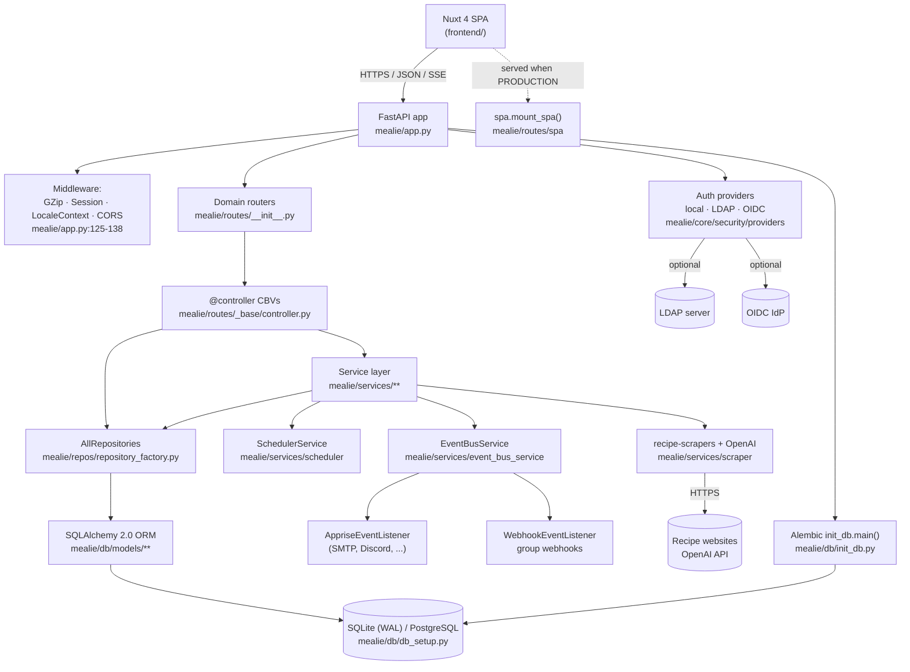
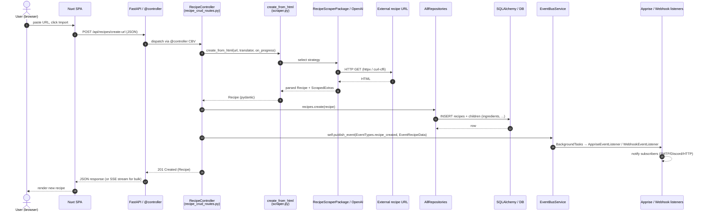
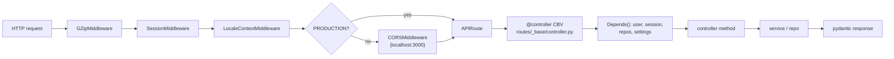

# System Overview — Mealie

> Audience: a senior engineer new to this system. Drafted by an LLM (skill: `system-overview`), requires human review.
> Canonical sections (`CORE ANALYSIS`, `SYSTEM DESIGN`, `LEGACY ASSESSMENT`) follow the Sumner/Chesser prompt. Optional extensions (cross-cutting concerns, hotspots, open questions) are clearly marked.
> Inferences not directly supported by a file are prefixed `UNVERIFIED:`.

Mealie is a self-hosted recipe manager, meal planner, and shopping-list application. Backend is a Python 3.12 FastAPI monolith (`mealie/app.py:115`) backed by SQLAlchemy 2.x ORM with Alembic migrations, supporting SQLite (default, with WAL pragma) and PostgreSQL (`mealie/db/db_setup.py:16-30`, `pyproject.toml:46-49`). Frontend is a separate Nuxt 4 / Vue / Vuetify SPA in `frontend/` (`frontend/package.json:21-39`). Notable third-party integrations: `recipe-scrapers` for recipe import, `openai` for AI-assisted scraping, `apprise` for notifications, `python-ldap` and `authlib` for LDAP/OIDC auth (`pyproject.toml:8-50`).

---

## CORE ANALYSIS (Required)

### Tools, frameworks, and design patterns

- **Web framework:** FastAPI 0.136 with class-based views via a custom `@controller` decorator (`mealie/routes/_base/controller.py:20-30`, adapted from `fastapi-utils`). Controllers inherit from `_BaseController` / `BaseUserController` / `BasePublicController` (`mealie/routes/_base/base_controllers.py:32-134`).
- **ORM:** SQLAlchemy 2.0 with declarative `Mapped[...]` annotations (`mealie/db/models/recipe/recipe.py:42-50`). A custom `BaseMixins` is inherited by every model (`mealie/db/models/recipe/recipe.py:38`, defined in `mealie/db/models/_model_base.py`).
- **Repository pattern:** All persistence flows through `AllRepositories` aggregating per-domain repos (`mealie/repos/repository_factory.py`). Construction is funnelled through `get_repositories(session, group_id=..., household_id=...)` (`mealie/repos/all_repositories.py:8-11`), which scopes queries by tenant.
- **Multitenancy:** Two-level scoping — *group* (tenant) and *household* (sub-tenant). The repository factory accepts both IDs and the recipe model carries `group_id` plus a unique constraint on `(slug, group_id)` (`mealie/db/models/recipe/recipe.py:44-46`). Test suite includes a dedicated `tests/multitenant_tests/` directory.
- **Migrations:** Alembic, 47 versioned migrations as of writing (`mealie/alembic/versions/` — count via `ls | wc -l`). Bootstrapping runs Alembic on startup via `init_db.main()` (`mealie/app.py:64-69`).
- **Background work:** Custom in-process scheduler (`mealie/services/scheduler/scheduler_service.py`, `scheduler_registry.py`). Tasks are registered for daily / hourly / minutely cadences in `mealie/app.py:131-148`. UNVERIFIED: scheduler appears to be asyncio-based rather than a Celery/RQ external worker.
- **Event bus:** Internal pub/sub for domain events. Controllers call `self.publish_event(...)` (e.g. `mealie/routes/recipe/recipe_crud_routes.py:260-526`); listeners (`AppriseEventListener`, `WebhookEventListener`) dispatch to apprise notifiers and group webhooks (`mealie/services/event_bus_service/event_bus_service.py:9-12`, `event_bus_listeners.py:23-30`).
- **Auth:** Local password (bcrypt), LDAP, and OIDC (`mealie/core/security/providers/`, `mealie/pkgs` — `pyproject.toml:42` for `authlib`). Sessions secured with Starlette `SessionMiddleware` (`mealie/app.py:127`).
- **Recipe ingestion:** Strategy pattern over scrapers. `create_from_html(...)` in `mealie/services/scraper/scraper.py:25` selects between `RecipeScraperPackage` (recipe-scrapers library) and `RecipeScraperOpenAI` (`mealie/routes/recipe/recipe_crud_routes.py:71-75`).
- **API clients via SSE:** Recipe import streams progress to the client over Server-Sent Events (`fastapi.sse.EventSourceResponse`, imported in `mealie/routes/recipe/recipe_crud_routes.py:21`).
- **Linting / typing toolchain:** `ruff`, `mypy` (with pydantic plugin), `pylint`, `pre-commit`, plus `import-linter` (`pyproject.toml:75-93`, `.import_linter_cache/` present at repo root) — UNVERIFIED: contracts file location not inspected here.

### Data models and API design

The aggregate root is `RecipeModel` (`mealie/db/models/recipe/recipe.py:42`), which composes a rich graph of children (ingredients, instructions, nutrition, assets, comments, timeline events, settings, tags, categories, tools, notes, share tokens) — see imports at `mealie/db/models/recipe/recipe.py:14-32`. Many-to-many relationships use association tables (`recipes_to_tags`, `recipes_to_categories`, `recipes_to_tools`).

The tenant hierarchy is `Group → Household → User/Recipe-references`. Recipes belong to a group; `HouseholdToRecipe` and `UserToRecipe` are link tables for per-household / per-user state (`mealie/db/models/recipe/recipe.py:22-23`).

Pydantic schemas live under `mealie/schema/` mirroring the model layout (`mealie/schema/recipe/`, `mealie/schema/household/`, etc.). `MealieModel` is the shared base (`mealie/repos/repository_generic.py:19`).

REST API is mounted at `/api` and composed of per-domain routers — `app`, `auth`, `users`, `households`, `groups`, `recipe`, `organizers`, `shared`, `comments`, `parser`, `unit_and_foods`, `admin`, `validators`, `explore` (`mealie/routes/__init__.py:5-32`). A separate `media_router` and `utility_routes.router` are registered directly on the FastAPI app (`mealie/app.py:175-178`). When `PRODUCTION=true`, the SPA is served from the same process (`mealie/app.py:179-180`).

### Architecture diagram

---

## SYSTEM DESIGN (Required)

### Central modules — file by file

- `mealie/main.py:8-19` — production entrypoint. Calls `uvicorn.run("mealie.app:app", ...)` using settings from `mealie/core/config.py`.
- `mealie/app.py:60-110` — FastAPI lifespan handler. On startup it (1) runs `init_db.main()` (Alembic + seed data), (2) starts the scheduler, (3) logs feature flags (SMTP/LDAP/OIDC/OpenAI). On shutdown it logs a banner.
- `mealie/app.py:115-180` — FastAPI app construction, middleware stack, debug handler registration, router inclusion, SPA mount in production, and tag de-duplication on `APIRoute` instances (`mealie/app.py:184-186`) — a workaround for `@controller`-decorated endpoints that double-tag.
- `mealie/db/init_db.py:30-45` — bootstrap: ensures default group + household exist and seeds the default user (`default_user_init`).
- `mealie/db/db_setup.py:16-50` — SQLAlchemy engine / session factory. SQLite WAL pragma is auto-enabled via a `connect` event listener.
- `mealie/repos/repository_factory.py:1-50` — `AllRepositories` aggregate collecting per-domain repositories; the SQLAlchemy `Session` flows through here.
- `mealie/repos/repository_generic.py:1-23` — generic CRUD primitives shared across repositories.
- `mealie/routes/_base/controller.py:20-120` — class-based-view decorator that fakes FastAPI's DI into `__init__` parameters of controller classes.
- `mealie/routes/_base/base_controllers.py:32-134` — controller base classes. `BaseUserController` injects the authenticated user; `BasePublicController` is for unauthenticated; `BasePublicGroupExploreController` / `...HouseholdExploreController` cover the unauthenticated `explore/` API surface.
- `mealie/routes/recipe/recipe_crud_routes.py` — the heart of the recipe API. Imports show the breadth of integration: scrapers, event bus, SSE, repositories, and image / asset services.
- `mealie/services/scraper/scraper.py:25-45` — `create_from_html(...)` is the single entry into recipe ingestion. Strategies are picked by the controller depending on the requested mode.
- `mealie/services/event_bus_service/event_bus_service.py:1-40` — `EventBusService` resolves listeners (`AppriseEventListener`, `WebhookEventListener`) at publish time and uses `BackgroundTasks` to dispatch.
- `mealie/services/event_bus_service/publisher.py:1-30` — Apprise + Webhook publishers behind a structural `PublisherLike` Protocol.
- `mealie/services/scheduler/` — `runner.py`, `scheduler_service.py`, `scheduler_registry.py`, `scheduled_func.py`. Tasks live under `mealie/services/scheduler/tasks/`.
- `mealie/middleware/locale_context.py` — sets per-request locale into a `ContextVar` for translation lookups (used via `mealie.lang.providers.Translator`, referenced in `mealie/services/scraper/scraper.py:9`).
- `mealie/core/security/security.py` + `providers/` — password hashing and pluggable auth providers.

### Primary data flow — "Import a recipe by URL"

> The bulk variant streams progress over SSE — `EventSourceResponse`, `SSEDataEventStatus`, `SSEDataEventDone` are imported at `mealie/routes/recipe/recipe_crud_routes.py:21,55-58`. UNVERIFIED: exact endpoint path for the bulk SSE flow not opened during this pass.

### Request lifecycle (control flow)

---

## LEGACY ASSESSMENT

### Inconsistencies in architectural patterns

- **Two `main()` functions.** `mealie/main.py:8` is the production uvicorn launcher; `mealie/app.py:170` (end of file) is a `__main__` shim with `reload=True`. Both call `uvicorn.run` with overlapping but non-identical args (e.g., `host`, `forwarded_allow_ips`, `log_config`). Easy footgun for someone running `python -m mealie.app` and getting different behaviour than the published `mealie` script (`pyproject.toml:51`).
- **APIRoute tag de-duplication hack.** `mealie/app.py:184-186` strips duplicate tags from every route after `include_router`. Comment says this works around `@controller` double-tagging routes. Indicates friction between the custom CBV decorator and FastAPI's tag handling; a future FastAPI/`fastapi-utils` upgrade may make this redundant or break it.
- **Default settings mutation at module import.** `mealie/db/db_setup.py:13` and `mealie/services/event_bus_service/event_bus_service.py:18` both call `get_app_settings()` at import time and bind to a module-level `settings`. Mixed with the `connect`-event SQLite pragma (`mealie/db/db_setup.py:16-30`) using the cached global, this couples test fixtures to import order. UNVERIFIED: whether tests work around this with monkeypatching.
- **Scheduler is in-process.** Tasks (`tasks.purge_*`, `tasks.post_group_webhooks`, `tasks.locked_user_reset`) are registered in `mealie/app.py:131-148` and run inside the same uvicorn worker. With `WORKERS > 1` (`mealie/main.py:13`) the scheduler will fire on every worker — UNVERIFIED: there is no obvious leader-election guard in `start_scheduler()`. This is a known footgun in single-process scheduler designs.
- **Mix of `mealie.pkgs` and ad-hoc utilities.** `mealie/pkgs/` appears to be an internal "packages" namespace (used for `cache`, `security` re-exports — `mealie/core/security/__init__.py:1`), while one-off helpers live directly under `mealie/services/.../`. UNVERIFIED: criteria for what becomes a "pkg" vs stays a service helper.
- **`exceptions.py` re-exports.** `mealie/core/security/__init__.py:1` is `from .security import *` — wildcard re-export at a package boundary. Modern Python style would explicitly enumerate.

### Deviations from language / framework conventions

- **`from .security import *`** at `mealie/core/security/__init__.py:1` is a wildcard re-export despite `ruff` enabling import sorting (`I` rule in `pyproject.toml:111`) — `F403` is explicitly listed in `ignore` (`pyproject.toml:103`), so the project has consciously opted out.
- **High mccabe ceiling.** `max-complexity = 24` (`pyproject.toml:120`) — almost 2.5× ruff's default of 10. Consistent with a long-lived FastAPI app, but worth reviewing for hotspots in `recipe_crud_routes.py` which already shows 10+ `publish_event` call sites in a single controller.
- **Pinned-exact dependencies (`add-bounds = "exact"`, `pyproject.toml:124`).** Diverges from typical Python convention of caret/upper-bound pinning. Renovate is configured (`renovate.json` present) so this is intentional — every bump is a PR. Not legacy debt; just non-default.
- **Custom `auto_init` mixin** (`mealie/db/models/_model_utils/auto_init.py`, referenced at `mealie/db/models/recipe/recipe.py:15`) — UNVERIFIED, but the name suggests reflection-based ORM construction, which can hide failures and trip type checkers.

### Old vs. new architectural approaches

- **CBV via decorator, not native FastAPI APIRouter classes.** The `@controller` pattern (`mealie/routes/_base/controller.py:20`) predates FastAPI's stronger DI ergonomics around 2023. Newer code might prefer plain dependency-injected functions; the project has standardised hard on the CBV style, so this is consistency, not drift. Keep the convention when adding new routes.
- **Two-tier tenancy added on top.** `Household` and `HouseholdToRecipe` (`mealie/db/models/recipe/recipe.py:21-22`) appear to be a layer added on top of the original `Group`-only model — UNVERIFIED, but the proliferation of `RepositoryHousehold`, `RepositoryHouseholdRecipes`, and `tests/multitenant_tests/` alongside the older `Group` tables in `mealie/repos/repository_factory.py:21-26` is consistent with that history. Newer features should use the household-aware repos.
- **47 Alembic revisions** going back to `2022-02-21` (`mealie/alembic/versions/`) — non-trivial schema evolution. Treat schema changes carefully; the test fixtures and seed (`mealie/repos/seed/`) likely depend on existing column shapes.

---

## Cross-cutting concerns *(optional extension — not in canonical Sumner/Chesser shape)*

- **Auth.** Pluggable providers under `mealie/core/security/providers/` (LDAP, OIDC, local). Sessions live in Starlette's `SessionMiddleware` with `SESSION_SECRET` (`mealie/app.py:127`). Long-lived API tokens are first-class (`LongLiveToken` in `mealie/repos/repository_factory.py:38`).
- **Logging.** Centralised in `mealie/core/root_logger.py` and `mealie/core/logger/config.py` (used at `mealie/main.py:4`). Settings dump (with secrets excluded) on startup, `mealie/app.py:73-93`.
- **Configuration.** `pydantic-settings` based; cached singleton via `get_app_settings()` (`mealie/core/config.py`). Feature flags (`SMTP_FEATURE`, `LDAP_FEATURE`, `OIDC_FEATURE`, `OPENAI_FEATURE`) are computed properties on the settings object (`mealie/app.py:84-90`).
- **i18n.** `LocaleContextMiddleware` (`mealie/middleware/locale_context.py`) plus a `Translator` provider (`mealie.lang.providers`) — language assets live in `mealie/lang/` and `frontend/i18n.config.ts`.
- **Error handling.** `register_debug_handler(app)` (`mealie/app.py:139`, defined in `mealie/routes/handlers.py`); domain exceptions in `mealie/core/exceptions.py`.

## Hotspots & open questions *(optional extension)*

- `mealie/routes/recipe/recipe_crud_routes.py` — the largest controller surface in the repo. 10+ event-bus call sites in one file; high attractiveness for future complexity. Worth profiling for cyclomatic complexity (the project's `max-complexity = 24` masks this from CI).
- **Scheduler under multiple workers.** `WORKERS = settings.WORKERS` in `mealie/main.py:13` combined with in-process `SchedulerService.start()` (`mealie/app.py:154`) — UNVERIFIED: confirm whether `WORKERS > 1` is supported or implicitly forbidden.
- **`UNVERIFIED:` items collected above:**
  1. Whether `import-linter` contracts file exists at the expected path (a `.import_linter_cache/` dir is present at the repo root).
  2. Exact endpoint path and behaviour of the SSE-based bulk import.
  3. Behaviour of `auto_init` mixin under static type checking.
  4. Whether the tenancy model evolved Group → Household, or both shipped together.
  5. Scheduler safety with multiple uvicorn workers.
  6. Whether tests rely on import-time `get_app_settings()` caching.

---

*Drafted by an LLM with file-level grounding; every claim either cites a path (`file:line` where useful) or is prefixed `UNVERIFIED:`. Review before sharing as authoritative documentation.*
