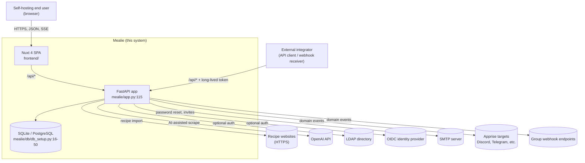

# 3. Context and Scope

## 3.1 Business Context

Sources: `mealie/app.py:115-180`, `mealie/routes/__init__.py:5-32`, `mealie/services/scraper/scraper.py:25-45`, `mealie/core/security/providers/` (LDAP, OIDC, local — `pyproject.toml:42`), `mealie/services/event_bus_service/event_bus_service.py:1-40`, `mealie/services/event_bus_service/publisher.py:1-30`.

## 3.2 Technical Context

| Channel | Direction | Protocol | Purpose | Reference |
|---|---|---|---|---|
| Browser ↔ SPA | bidirectional | HTTPS | UI delivery; SPA mounted into FastAPI when `PRODUCTION=true` | `mealie/app.py:179-180`, `mealie/routes/spa` |
| SPA / integrator → API | inbound | HTTPS, JSON, SSE | REST CRUD + Server-Sent Events for streaming import progress | `mealie/routes/__init__.py:5-32`, `mealie/routes/recipe/recipe_crud_routes.py:21` |
| API → DB | outbound | SQLAlchemy driver (sqlite / psycopg) | Persistence | `mealie/db/db_setup.py:16-50` |
| API → Recipe websites | outbound | HTTPS via `recipe-scrapers` | Recipe ingestion | `mealie/services/scraper/scraper.py:25-45` |
| API → OpenAI | outbound | HTTPS, OpenAI SDK | AI-assisted scraping (feature-flagged via `OPENAI_FEATURE`) | `pyproject.toml:8-50`, `mealie/app.py:84-90` |
| API ↔ LDAP | outbound | LDAP via `python-ldap` | Optional authentication | `mealie/core/security/providers/ldap_provider.py` |
| API ↔ OIDC | outbound | OAuth2 / OIDC via `authlib` | Optional authentication | `mealie/core/security/providers/openid_provider.py` |
| API → SMTP | outbound | SMTP | Outbound email (feature-flagged via `SMTP_FEATURE`) | `mealie/app.py:84-90` |
| API → Apprise targets | outbound | HTTPS / SMTP / vendor APIs via `apprise` | Domain-event notifications | `mealie/services/event_bus_service/publisher.py:1-30` |
| API → group webhooks | outbound | HTTPS POST | Domain-event delivery to user-configured URLs | `mealie/services/event_bus_service/event_bus_listeners.py:23-30` |

## 3.3 Scope

### In scope

- The FastAPI backend under `mealie/` (routes, repos, services, schema, ORM, middleware).
- The Nuxt SPA under `frontend/`.
- The Alembic migration history under `mealie/alembic/versions/`.
- Authentication providers (local password, LDAP, OIDC) under `mealie/core/security/providers/`.
- The in-process scheduler and event bus (`mealie/services/scheduler/`, `mealie/services/event_bus_service/`).
- Recipe ingestion strategies (`mealie/services/scraper/`).
- Bootstrapping behaviour: Alembic on startup, default group/household/user seeding (`mealie/app.py:60-69`, `mealie/db/init_db.py:30-45`).

### Out of scope

- The DBMS itself. Mealie supports SQLite and PostgreSQL; operating, tuning, or backing them up is the operator's responsibility.
- The LDAP / OIDC / SMTP servers and Apprise targets. Mealie is a client; their availability and configuration sit outside the system.
- External recipe websites and the OpenAI API. Mealie consumes them; their schemas and rate limits are not controlled here.
- The reverse proxy / TLS terminator typically deployed in front of Mealie.
- The runtime container image build (Dockerfile / compose recipes) — see deployment artefacts under `docker/`, documented in chapter 7.
- Mobile clients. Only the bundled SPA is shipped from this repository.
