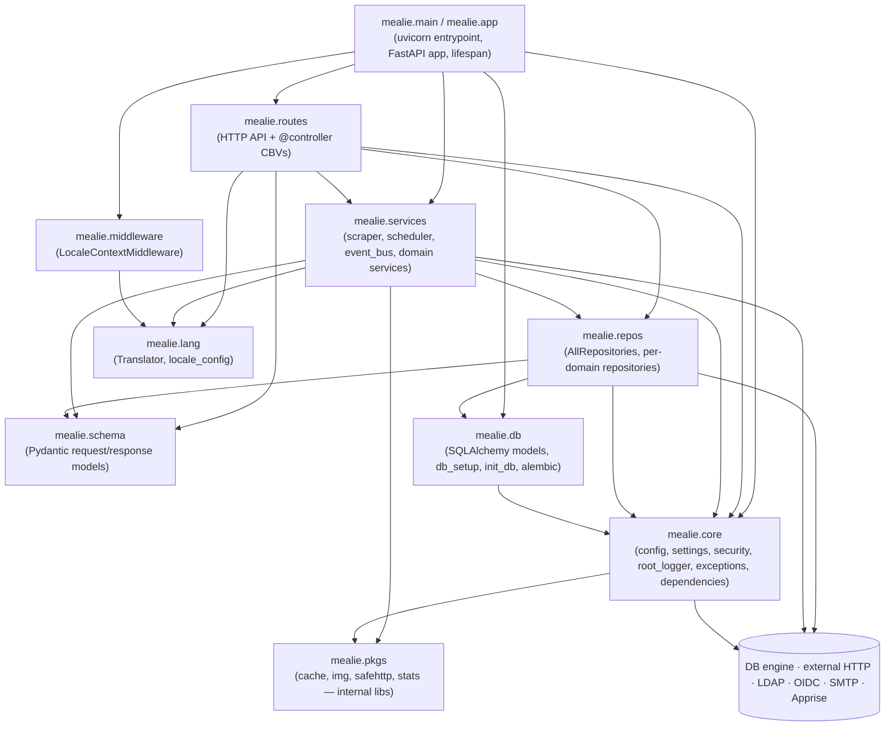

# 5. Building Block View

This chapter describes the static structure of the Mealie backend. The Nuxt SPA in `frontend/` is treated as an external building block here; its internal structure is documented separately.

The diagram and prose below are derived from the import graph in [`../architecture/grimp.dot`](../architecture/grimp.dot). LikeC4 views in `docs/architecture/` will be cross-referenced once Step 3c lands.

## 5.1 Whitebox: Mealie Backend (Level 1)

The arrows mirror the import edges in `docs/architecture/grimp.dot` (e.g. `mealie.app → mealie.routes` line 7; `mealie.repos.* → mealie.db.*` and `mealie.core.dependencies.dependencies → mealie.repos.all_repositories` line 19).

## 5.2 Building blocks (Level 1 prose)

### `mealie.app` / `mealie.main` — Entry & composition root

**Responsibility.** Build the FastAPI app, register middleware, include domain routers, mount the SPA in production, run startup/shutdown hooks (Alembic via `init_db.main()`, scheduler start/stop, feature-flag logging).
**Key types.** `app: FastAPI` (`mealie/app.py:115`); `lifespan` async context manager (`mealie/app.py:60-110`); production launcher `mealie/main.py:8-19`.
**Key collaborators.** `mealie.middleware`, `mealie.routes`, `mealie.services.scheduler`, `mealie.db.init_db`, `mealie.core.config`.
**Notes.** Includes a tag de-duplication workaround on `APIRoute` instances at `mealie/app.py:184-186`. A second `__main__` shim at `mealie/app.py:170` overlaps with `mealie/main.py` — flagged in `SYSTEM_OVERVIEW.md` legacy assessment.

### `mealie.routes` — HTTP API surface

**Responsibility.** Receive HTTP requests, validate via Pydantic, dispatch to services / repositories, publish domain events. Implements the class-based-view pattern.
**Key types.** `@controller` decorator (`mealie/routes/_base/controller.py:20-30`); base classes `_BaseController`, `BaseUserController`, `BasePublicController`, `BasePublicGroupExploreController` (`mealie/routes/_base/base_controllers.py:32-134`); per-domain routers wired in `mealie/routes/__init__.py:5-32` (`app`, `auth`, `users`, `households`, `groups`, `recipe`, `organizers`, `shared`, `comments`, `parser`, `unit_and_foods`, `admin`, `validators`, `explore`); separate `media_router` and `utility_routes.router` registered directly on the app at `mealie/app.py:175-178`.
**Key collaborators.** `mealie.services`, `mealie.repos`, `mealie.schema`, `mealie.core.security`.

### `mealie.services` — Domain services

**Responsibility.** Orchestrate multi-step domain operations that are larger than a CRUD call: recipe ingestion, scheduling, event-bus dispatch, group/household/user services, shopping-list logic.
**Key types.** `create_from_html(...)` (`mealie/services/scraper/scraper.py:25-45`) selecting between `RecipeScraperPackage` and `RecipeScraperOpenAI`; `EventBusService` (`mealie/services/event_bus_service/event_bus_service.py:1-40`); `AppriseEventListener` and `WebhookEventListener` (`mealie/services/event_bus_service/event_bus_listeners.py:23-30`); `SchedulerService` and `scheduler_registry` (`mealie/services/scheduler/`); `publish_list_item_events` (`mealie/services/household_services/shopping_list_events.py`) — extracted from the shopping-list controller per ADR-0001 so both the controller and the scheduler task import it from the services layer.
**Key collaborators.** `mealie.repos`, `mealie.schema`, `mealie.pkgs`, `mealie.lang.providers.Translator` (referenced at `mealie/services/scraper/scraper.py:9`).
**Layering constraint.** `mealie.services` MUST NOT import from `mealie.routes`. Enforced by the `services must not depend on routes` `forbidden` contract in `pyproject.toml` (see ADR-0001); `ignore_imports` is empty as of 2026-05-03.

### `mealie.repos` — Repository layer

**Responsibility.** All persistence access. Aggregates per-domain repositories behind a single factory and enforces tenant scoping at construction time.
**Key types.** `AllRepositories` (`mealie/repos/repository_factory.py`); `get_repositories(session, group_id=..., household_id=...)` (`mealie/repos/all_repositories.py:8-11`); `RepositoryGeneric` CRUD primitives (`mealie/repos/repository_generic.py:1-23`); per-domain repos `repository_recipes`, `repository_household`, `repository_group`, `repository_users`, `repository_meals`, `repository_meal_plan_rules`, `repository_shopping_list`, `repository_cookbooks`, `repository_foods`, `repository_units` (visible in `docs/architecture/grimp.dot`).
**Key collaborators.** `mealie.db.models.*`, `mealie.schema.*`.

### `mealie.db` — ORM, schema, migrations, bootstrap

**Responsibility.** Define SQLAlchemy models, build the engine and session factory, run Alembic on startup, seed defaults.
**Key types.** `BaseMixins` shared by every model (`mealie/db/models/_model_base.py`, used at `mealie/db/models/recipe/recipe.py:38`); `RecipeModel` aggregate root (`mealie/db/models/recipe/recipe.py:42-50`); engine/session in `mealie/db/db_setup.py:16-50` (SQLite WAL pragma via `connect` event listener); `init_db.main()` (`mealie/db/init_db.py:30-45`); 47 versioned migrations under `mealie/alembic/versions/`.
**Key collaborators.** `mealie.core.config` (DB URL & settings — `mealie/db/db_setup.py:13`); `mealie.repos.seed.init_users`.

### `mealie.schema` — Pydantic models

**Responsibility.** Request and response models for the HTTP layer; mirrors the ORM layout (`mealie/schema/recipe/`, `mealie/schema/household/`, etc.).
**Key types.** `MealieModel` shared base (`mealie/repos/repository_generic.py:19`); per-domain submodules (`mealie.schema.user.user`, `mealie.schema.user.auth`, `mealie.schema.household.household`, etc.).
**Key collaborators.** `mealie.routes`, `mealie.repos`, `mealie.services`.

### `mealie.core` — Configuration, security, dependencies, logging

**Responsibility.** Cross-cutting infrastructure: settings (pydantic-settings), authentication providers, FastAPI dependency providers, root logger, exceptions.
**Key types.** `get_app_settings()` cached singleton (`mealie/core/config.py`, used at `mealie/db/db_setup.py:13` and `mealie/services/event_bus_service/event_bus_service.py:18`); auth providers `credentials_provider`, `ldap_provider`, `openid_provider` plus `auth_provider` base (`mealie/core/security/providers/`); FastAPI deps in `mealie/core/dependencies/dependencies.py`.
**Key collaborators.** `mealie.repos.all_repositories` (auth providers resolve users via repos — `docs/architecture/grimp.dot` lines 31-54); `mealie.db.db_setup` (deps inject sessions); `mealie.pkgs`.

### `mealie.middleware` — ASGI middleware

**Responsibility.** Per-request cross-cutting behaviour. Currently `LocaleContextMiddleware` setting a `ContextVar` for translation lookups.
**Key types.** `LocaleContextMiddleware` (`mealie/middleware/locale_context.py`).
**Key collaborators.** `mealie.lang.providers.Translator`.

### `mealie.lang` — Internationalisation

**Responsibility.** Locale resolution and translated strings for backend-facing messages.
**Key types.** `Translator` provider (`mealie.lang.providers`); `locale_config` (`mealie.lang.locale_config`).
**Key collaborators.** `mealie.middleware.locale_context`, `mealie.services.scraper.scraper` (`mealie/services/scraper/scraper.py:9`), `mealie.core.exceptions` (per `docs/architecture/grimp.dot` line 22).

### `mealie.pkgs` — Internal library namespace

**Responsibility.** Re-usable utility packages with no domain knowledge — caching, image handling, a safe HTTP client, stats.
**Key types.** `mealie.pkgs.cache`, `mealie.pkgs.img`, `mealie.pkgs.safehttp`, `mealie.pkgs.stats`.
**Key collaborators.** Consumed by `mealie.services` and `mealie.core` (`mealie/core/security/__init__.py:1` re-exports). Boundary criteria between `pkgs` and ad-hoc service helpers is currently informal — flagged in `SYSTEM_OVERVIEW.md` legacy assessment.

## 5.3 Cross-references

- For load-bearing decisions (CBV via `@controller`, two-level tenancy, in-process scheduler, exact dependency pinning): see chapter 4 once written, with full ADRs in chapter 9.
- For dynamic behaviour (recipe-import sequence, request lifecycle): see chapter 6 once written; the canonical sequence diagrams already exist in `SYSTEM_OVERVIEW.md` and can be lifted from there.
- For LikeC4 model views of these same building blocks: see `docs/architecture/` (cross-references to be added once Step 3c is complete).
